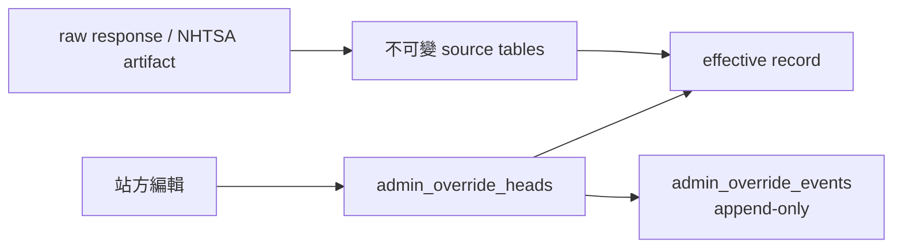
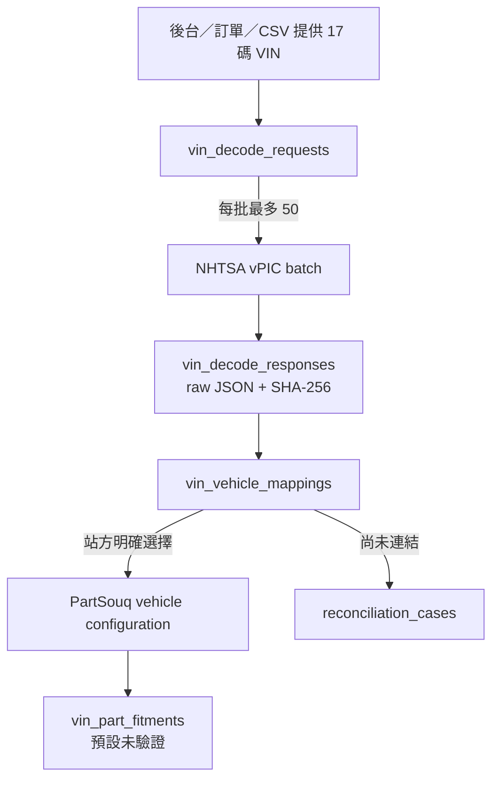
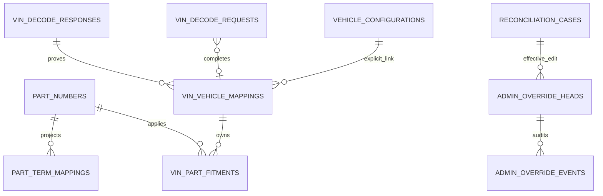
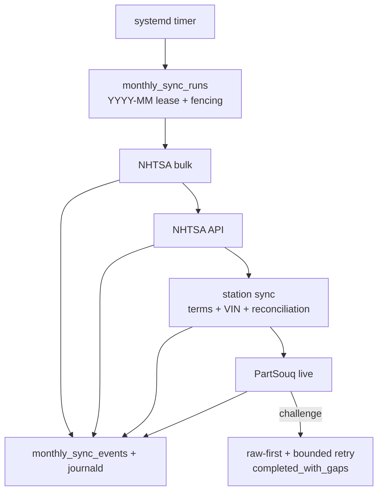

# NHTSA／PartSouq 資料與站方後台驗收報告

- 驗收日期：2026-08-10（Asia/Taipei）
- 資料庫：MySQL 8；`nhtsa` 與 `partsouq` schema 分離
- 後台：Flask／Jinja／PyMySQL／Gunicorn
- 判定基準：實際 MySQL 查詢、raw/provenance、完整自動測試與真實 HTTP E2E

## 1. 直接結論

**沒有，兩邊不能一起回答「全部都爬回來了」。**

- **NHTSA 固定的 12 個官方資料集已完成。** Current publication 有 457 個 artifacts、9,876,638 source rows，當前 rejected rows 是 0。
- **NHTSA 的 VIN 不是可全量列舉的資料集。** 系統只能解碼站方實際提供的 VIN。Production 目前沒有 VIN 輸入，所以 VIN vehicle mapping 與 VIN fitment 都是 0。
- **PartSouq 現行網站全量尚未完成。** 現有 live run 是 `paused`，156 個已發現 URL 中完成 7、pending 149。
- **PartSouq 165,438 筆 fitment 是歷史封存資料，不是現行完整型錄。** 全部 `is_verified=0`。
- **站方後台程式已完成並實際跑通。** 可編輯車型、分類、分解圖、料號、適用關係、中英文／俗稱、VIN 對應與對帳案件；所有修改有版本與 audit，不會覆蓋爬蟲來源。
- **截圖需求的資料內容還沒全齊。** 51,520 筆英文零件名已投影，但正式正體中文名與俗稱都是 0；目前建立 51,520 筆待對帳案件。

因此目前整體狀態是：**後台與資料管線完成；NHTSA 固定資料完成；PartSouq current/full、中文內容與 production VIN 資料未完成。**

## 2. 截圖六項需求逐項驗收

| # | 需求 | 判定 | 實際資料 | 已完成的後台能力 | 尚缺 |
|---:|---|---|---|---|---|
| 1 | 汽車中文零件與英文零件對照 | 部分完成 | 英文名 51,520；正式中文名 0 | 建立、編輯、搜尋、停用、恢復、來源追溯、audit | 中文權威資料或人工輸入 |
| 2 | 中文零件與中文常用俗稱對照 | 部分完成 | 正式俗稱 0 | 多值 JSON 俗稱欄位、搜尋與版本紀錄 | 中文俗稱資料來源 |
| 3 | VIN 代表的品牌、型號、樣式、年份 | 部分完成 | Production VIN mapping 0；官方測試 VIN E2E 通過 | VIN 輸入表單、持久 queue、NHTSA batch decode、raw JSON/SHA | 訂單／CSV／內部 API 的 production VIN feed |
| 4 | 料號、零件名稱、適合 VIN 與品牌／型號／樣式／年份 | 資料未完成 | 歷史 fitment 165,438，全未驗證；VIN fitment 0 | 可編輯料號與適用關係；VIN 必須明確連結 PartSouq vehicle 後才投影 | PartSouq current/full、VIN feed、人工驗證 |
| 5 | 零件大／中／小分類 | 部分完成 | `taxonomy_nodes` 74,624，以歷史封存為主 | 任意深度 parent-child、搜尋、編輯、停用與追溯 | 現行全量覆蓋與中文分類名 |
| 6 | 對帳頻道 | 程式完成；資料待處理 | 51,520 個 open 翻譯案件 | 指派、留言、改嚴重度／狀態、結案、append-only audit | 站方實際處理規則與人員 |

「部分完成」不是語意模糊：代表 CRUD／queue／audit／資料模型已具備，但 production 內容缺失或未驗證，不能對外當作完整正確資料。

## 3. NHTSA 實際 current publication

最新 full-scope run：`nhtsa-bulk-all-coverage-v4`，狀態 `completed`，source rows 9,736,498，rejected 0。加上 current API artifacts 後，current publication 合計 9,876,638 rows。

| Dataset | Current rows | Rejected | Artifacts |
|---|---:|---:|---:|
| manufacturer_communications | 5,797,781 | 0 | 7 |
| complaints | 2,233,015 | 0 | 7 |
| manufacturer_communications_summary | 1,208,330 | 0 | 7 |
| recalls | 325,810 | 0 | 2 |
| investigations | 154,249 | 0 | 1 |
| vpic_variable_values | 69,689 | 0 | 144 |
| vpic_models | 31,827 | 0 | 1 |
| vpic_manufacturers | 22,881 | 0 | 229 |
| safety_ratings | 17,313 | 0 | 1 |
| vpic_makes | 12,321 | 0 | 1 |
| cssi_stations | 3,278 | 0 | 56 |
| vpic_variables | 144 | 0 | 1 |
| **合計** | **9,876,638** | **0** | **457** |

資料庫歷史仍保留 5 個 quarantined artifacts 與 9 筆 rejected rows；它們屬於先前失敗嘗試，沒有被 current pointers 發布。

NHTSA 官方說明 vPIC 是 VIN decoding 與車輛／製造商資料平台，API 受 automated traffic rate control；Batch Decode 每批最多 50 VIN。這個 API 是「解碼傳入的 VIN」，不是下載全球所有實際 VIN：[Vehicle API](https://vpic.nhtsa.dot.gov/api/Home/Index)、[vPIC About](https://vpic.nhtsa.dot.gov/About)。

## 4. PartSouq 實際資料與完成邊界

### 4.1 現有 MySQL 筆數

| Entity | Rows | 判讀 |
|---|---:|---|
| vehicle configurations | 21,510 | 歷史封存為主，另有少量 live |
| taxonomy nodes | 74,624 | 歷史封存為主，另有少量 live |
| diagrams | 2,724 | 主要為歷史封存 |
| part numbers | 52,102 | 主要為歷史封存 |
| part occurrences | 159,505 | 歷史封存 |
| fitments | 165,438 | 歷史封存；verified 0 |
| archive captures | 26,460 | Common Crawl 3,165；Wayback 23,295 |
| HTTP responses | 26,475 | 包含 live、archive、challenge |
| Cloudflare challenge responses | 1,530 | 已保存 raw body／reason |

### 4.2 為什麼 165,438 不是「完整匯出」

這 165,438 筆是從 Common Crawl／Wayback 歷史頁面解析出的 fitment，資料模式是 `historical_archive`，全部 `is_verified=0`。它們能當候選與歷史證據，但不能代表 PartSouq 今天網站的完整適用關係。

Current/full 的完成條件是：

```text
live queue exhausted
AND failed = 0
AND challenged = 0
AND skipped_robots = 0
AND parse_failed = 0
AND missing provenance = 0
AND foreign key violations = 0
```

現在 live run `partsouq-live-nodriver-e2e-20260810` 是：

| 指標 | 數值 |
|---|---:|
| status | paused |
| discovered | 156 |
| done | 7 |
| pending | 149 |
| challenged in this run | 0 |

所以目前只能確認本機已能取得少量 live 200、保存 raw、解析並續跑，**不能確認現行全量**。

### 4.3 Cloudflare 與 server 風險

- aiohttp、Playwright／Brave、Patchright：本機實測為 403 challenge。
- Headed Google Chrome + NoDriver：本機 macOS 可在無人工點擊下從初始 challenge 轉為 final 200。
- Linux Docker + Xvfb：仍為 403；開啟 Chrome sandbox 的 Docker 路徑無法啟動。

Cloudflare 官方文件明列 CLI、headless browser 與 Playwright／Selenium 等 automation 可能不受支援或被 challenge 阻擋：[Supported browsers](https://developers.cloudflare.com/cloudflare-challenges/reference/supported-browsers/)。因此月排程已實作 bounded retry、raw-first、circuit breaker 與 `completed_with_gaps`，但正式 Linux host 仍必須先做 live preflight。

## 5. 站方後台完成內容

### 5.1 可操作的十種資料

1. 車型設定
2. 零件大／中／小分類
3. 分解圖
4. 零件號碼
5. 零件出現紀錄
6. 適用關係
7. 零件中英／俗稱對照
8. VIN 對應車型
9. VIN 適用零件
10. 對帳頻道

每個 entity 支援 browse、prefix search、keyset pagination、create、update、retire、restore、detail、source provenance 與 audit history。

### 5.2 編輯不是直接改爬蟲來源



- `partsouq_admin` 對 crawler/source tables 只有 `SELECT`。
- 人工修改只寫 `admin_override_heads`；每次事件另寫 `admin_override_events`。
- 保存 revision、actor、reason、before/after JSON 與 base SHA。
- `expected_revision` 不符會回 HTTP 409，防止兩人互相蓋掉更新。
- Retire 是可恢復 tombstone，不刪 raw、source 或 provenance。

### 5.3 VIN 流程



系統不以品牌／型號字串 fuzzy join 自動連結 PartSouq vehicle，避免錯配。站方必須在後台填入 `partsouq_vehicle_configuration_id`，之後才投影 VIN 適用零件。

### 5.4 登入與權限

- Loopback 開發模式可不啟用登入。
- 非 loopback 綁定時，程式強制要求 `PARTSOUQ_ADMIN_USERNAME`、`PARTSOUQ_ADMIN_PASSWORD`、固定 secret 與 secure cookie；少一項就拒絕啟動。
- 正式範本以 Gunicorn 綁 `127.0.0.1:8086`，放在 HTTPS reverse proxy／既有 SSO 後方。
- CSRF、HttpOnly、SameSite=Strict、CSP、no-referrer、nosniff 已啟用。
- Raw HTML 不會 inline 執行。

## 6. 新增 MySQL Schema

權威 migration：`src/partsouq_crawler/db/mysql_migrations/006_station_admin.sql`。

| Table | 用途 | 排重／一致性 |
|---|---|---|
| `part_term_mappings` | 英文零件名、正體中文名、中文俗稱、狀態、信心 | `(part_number_id,name_en_normalized)` generated SHA-256 unique；FK 到 part |
| `vin_decode_requests` | VIN 持久 queue | VIN unique；attempt、worker、lease、fencing token |
| `vin_decode_responses` | NHTSA raw JSON、HTTP、headers、bytes、SHA | batch key unique；body SHA |
| `vin_vehicle_mappings` | VIN → make/model/series/body/year/manufacturer | VIN unique；FK 到 raw response 與 PartSouq vehicle |
| `vin_part_fitments` | VIN → part/vehicle 候選適用關係 | VIN+part+vehicle+derivation SHA unique；預設 unverified |
| `reconciliation_cases` | 翻譯與 VIN link 對帳案件 | case SHA unique；current/candidate/evidence/comments JSON |
| `admin_override_heads` | 目前有效人工覆寫 | entity/identity unique；revision |
| `admin_override_events` | append-only audit | head/revision unique；before/after/actor/reason |
| `monthly_sync_runs` | 每月四個 source 的狀態 | `period_key=YYYY-MM` unique；owner/lease/fencing |
| `monthly_sync_events` | child stdout/stderr 與 progress | monthly run/source/type/id indexes |

### 6.1 關係圖



## 7. 每月無人值守流程

排程是台北時間每月 1 日 01:00。1 日 02:00 到 3 日 23:00 每小時做冪等 recovery check。



穩定性設計：

- 同月唯一 key，避免重複執行。
- Lease heartbeat 與 fencing token 防雙主與 stale writer。
- 完成的 source 不重跑，只續未完成 source。
- PartSouq、VIN、archive 都是 persistent queue，可從 crash／斷電續跑。
- 子程序 log 批次寫 MySQL，同時留 journald。
- SIGTERM 先給 30 秒收尾，再強制終止。
- Cloudflare challenge 保存 raw 後立即停止本次 run，不做密集 403 重試。

## 8. 資料正確性規則

- Raw response／artifact 先存，才 parse／normalize。
- Raw body 以 SHA-256 去重；PartSouq body 壓縮保存。
- 每筆 normalized record 都可追到 response、parser/version、source URL 或 archive locator。
- `ssd` 保持 opaque，不解析、不重排、不猜測。
- 搜尋提示不升級為 verified fitment。
- Historical archive fitment 固定 unverified。
- VIN 與 PartSouq vehicle 不做 fuzzy auto-join。
- 中文名稱／俗稱沒有正式來源時保持 null，不由模型或程式杜撰。
- 人工編輯只進 overlay/audit，不修改 source fact。

## 9. 完整自測結果

### 9.1 自動測試

```bash
PARTSOUQ_TEST_MYSQL=1 NHTSA_TEST_MYSQL=1 PYTHONPATH=. \
  .venv/bin/pytest -o addopts='' -q -W error
```

結果：**131 passed in 19.24s**。

注意：受限沙箱禁止 TCP／loopback 時，初次測試的失敗都是 `PermissionError: Operation not permitted`。在允許連本機 MySQL 與綁 `127.0.0.1:0` 的驗收環境重跑後，131 項全數通過；沒有 assertion failure。

### 9.2 測試層級

| Gate | 結果 | 實際驗證 |
|---|---|---|
| Full pytest | 131 passed | parser、challenge、queue、resume、archive、NHTSA、MySQL、monthly、admin、station |
| Fresh schema E2E | pass | 全新 schema v6；8 張站方／audit tables；expanded CHECK；FK 0 |
| Station MySQL E2E | pass | VIN queue、raw response、SHA、mapping、fitment provenance、重跑不變、解除連結清理 |
| 官方 NHTSA VIN E2E | HTTP 200 | 公開測試 VIN；ErrorCode 0；raw 3,890 bytes；body SHA 一致；11 個實際 response headers |
| Gunicorn HTTP E2E | pass | login 200；dashboard 2 SQL；terms list 3 SQL；VIN form 200；CSP 有效 |
| Admin permission E2E | pass | 低權限帳號 direct source UPDATE 被 MySQL 拒絕 |
| Query contract | pass | dashboard 固定 2 SQL；list 固定 3；資料量／fanout 不產生 N+1 |
| Code review 修正 | pass | Gunicorn 設定驗證、登入 redirect／Unicode、fitment provenance、舊投影清理、NHTSA rate limit／headers |
| Ruff | pass | `ruff check .`；120 files formatted |
| strict mypy | pass | 81 source files，0 issues |
| diff whitespace | pass | `git diff --check` 無輸出 |

### 9.3 Gunicorn 實際 HTTP 結果

```text
POST /login                         -> 302 -> GET / 200
X-Admin-Query-Count (dashboard)     -> 2
GET /entities/part_term_mappings    -> 200
X-Admin-Query-Count (terms list)    -> 3
GET /station/vins/request           -> 200
Content-Security-Policy             -> present
```

這次 HTTP E2E 只讀 production 既有資料，沒有把測試 VIN 寫進 production。

## 10. 部署方式

### 10.1 後台

```bash
sudo install -m 0644 deploy/systemd/partsouq-admin.service \
  /etc/systemd/system/partsouq-admin.service
sudo install -m 0600 deploy/systemd/admin.env.example \
  /etc/partsouq-crawler/admin.env
sudo systemctl daemon-reload
sudo systemctl enable --now partsouq-admin.service
```

Gunicorn 只綁 `127.0.0.1:8086`。正式網域、TLS 與 SSO／反向代理由既有站台層處理。

### 10.2 月排程

```bash
sudo install -m 0644 deploy/systemd/partsouq-monthly-sync.service \
  /etc/systemd/system/
sudo install -m 0644 deploy/systemd/partsouq-monthly-sync.timer \
  /etc/systemd/system/
sudo install -m 0600 deploy/systemd/monthly.env.example \
  /etc/partsouq-crawler/monthly.env
sudo systemctl daemon-reload
sudo systemctl enable --now partsouq-monthly-sync.timer
```

正式啟用前必須在同一台 Linux host、同一 egress IP、同一 service user 與同一 persistent Chrome profile 做 PartSouq 一頁 preflight。Final HTTP 不是 200 時，不得把 PartSouq current 標成完成；NHTSA 與 station source 仍可獨立執行。

## 11. 操作注意事項

1. 不要把歷史 archive 165,438 fitments 顯示成「現行完整適用」。
2. 不要把 `is_verified=0` 的 fitment 對外標成已確認。
3. 不要用程式生成中文名稱／俗稱來填滿 0 筆缺口。
4. 不要把 NHTSA 固定資料完成誤寫成「全球所有 VIN 已抓回」。
5. VIN 屬敏感識別資料；log、export、URL 預設遮蔽，備份不得進 GitHub。
6. 後台 source DB 權限保持 SELECT-only；不得改用 crawler write account。
7. 對帳結案必填 actor、reason／resolution，保留 audit。
8. PartSouq challenge 只做 bounded retry；raw 保存後標 blocked/gaps，不暴力重試。
9. 正式 Linux host 的 Chrome sandbox 必須啟用；不要以 `--no-sandbox` 當解法。
10. NoDriver 是 AGPL-3.0；部署／散布前要完成授權審查。

## 12. 目前待辦與建議順序

1. **指定 production VIN feed。** 決定從訂單 DB、CSV 或內部 API 寫入 `vin_decode_requests`。
2. **處理中文對帳。** 先依查詢量或業務優先級處理 51,520 筆 open translation cases。
3. **正式 Linux host preflight。** 通過後才開啟 PartSouq 月排程。
4. **續跑 PartSouq live queue。** 目前 149 pending；耗盡前維持 current/full=false。
5. **抽樣驗證 archive fitments。** 只有站方確認後才升為 verified。
6. **接既有站方登入。** 正式環境建議讓 reverse proxy／SSO 控制使用者，後台仍保留 CSRF 與 audit actor。

## 13. 尚待站方決定

- 中文名稱與俗稱的權威來源是人工、內部字典，還是供應商檔案？
- VIN feed 的欄位、頻率與保留政策？
- 歷史 fitment 對外顯示為「歷史候選」，或驗證前完全隱藏？
- 正式後台網域與既有 SSO／角色權限如何銜接？

## 14. 主要檔案

| 類別 | 檔案 |
|---|---|
| Station schema | `src/partsouq_crawler/db/mysql_migrations/006_station_admin.sql` |
| Station sync | `src/partsouq_crawler/services/station_catalog.py` |
| Admin routes | `src/partsouq_crawler/admin/routes.py` |
| Admin repository | `src/partsouq_crawler/admin/repository.py` |
| Admin DDL | `src/partsouq_crawler/admin/mysql_schema.sql` |
| Monthly orchestration | `src/partsouq_crawler/services/monthly_sync.py` |
| CLI | `src/partsouq_crawler/cli.py` |
| Gunicorn service | `deploy/systemd/partsouq-admin.service` |
| Admin env | `deploy/systemd/admin.env.example` |
| Station integration test | `tests/integration/test_station_catalog_mysql.py` |
| Admin integration test | `tests/integration/test_partsouq_admin_mysql.py` |

## 15. 發布邊界

- Git remote owner 必須是 `a861252012`。
- SSH welcome 必須是 `a861252012`。
- 禁止使用 Bibian 公司帳號、key 或 token。
- `.env`、raw artifacts、MySQL volume、VIN、`ssd`、archive index 與匯出資料不得進 Git。
- 這份驗收報告是 2026-08-10 的資料快照，不是 live dashboard。
