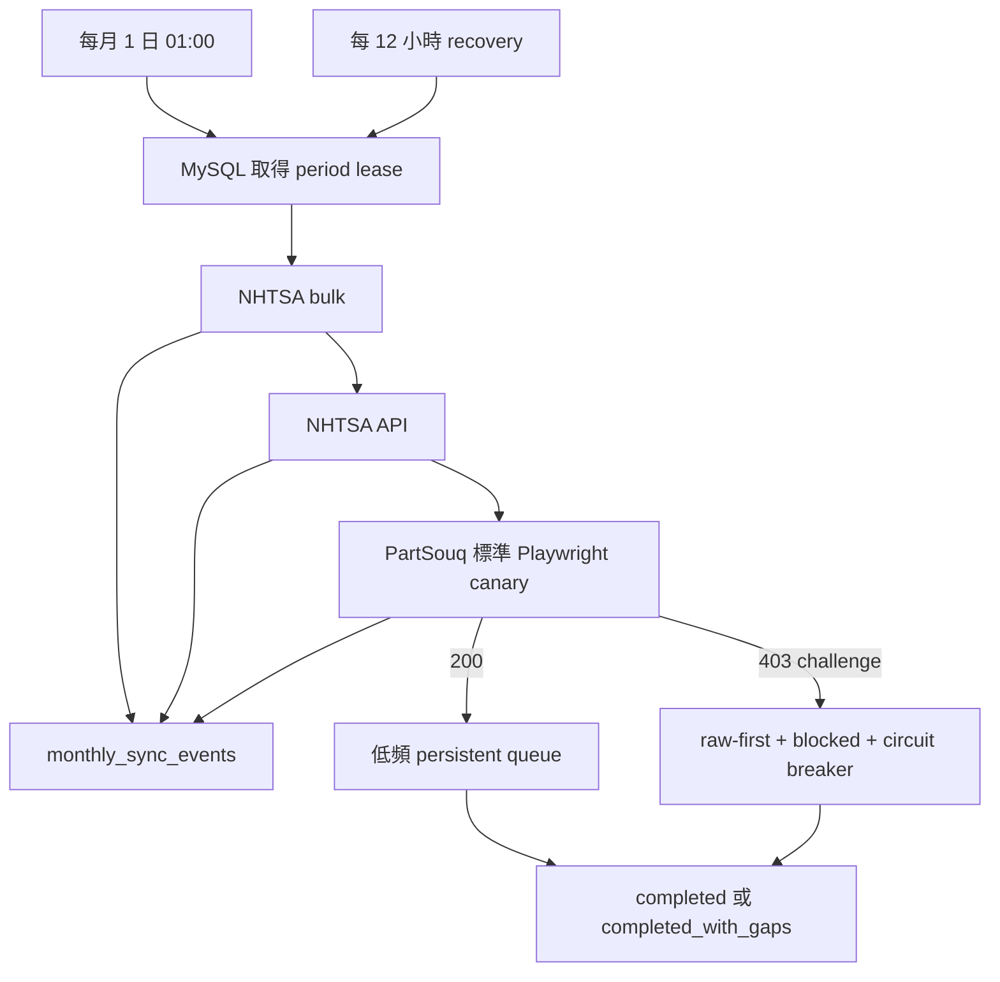

# NHTSA／PartSouq 資料管線、站方後台與 E2E 最終報告

- 驗收時間：2026-08-10 21:24 CST
- 驗收 branch：`agent/mysql-admin-archive-import`
- 驗收基準：`105ffeebd8ce64326d643392151c023982ce7ed5` 加本報告列出的 working-tree 變更
- 資料庫：本機 MySQL 8，`127.0.0.1:3308`
- 整體判定：**部分完成，可交付已完成範圍；PartSouq 現行 live 全量仍未完成**

## 1. 先講結論

### 已完成

1. NHTSA 指定範圍的官方 bulk 與 API 資料已實際同步、寫入 MySQL、原子發布 current。
2. PartSouq 已取得並正規化大量真實歷史封存資料，全部 raw response、SHA-256、archive 座標與 provenance 都在 MySQL。
3. PartSouq 歷史資料已重解析：52,102 個料號、159,753 個 occurrence、165,686 個 historical fitment。
4. 本機站方後台已具備 10 類資料的瀏覽、搜尋、建立、修改、停用、恢復、audit 與對帳功能。
5. 每月 1 日 01:00 的無人值守流程、同月排重、lease、heartbeat、fencing、斷點續跑、DB event log、SIGTERM 收尾與 recovery 已實作。
6. 完整測試、production DB integrity、raw artifact、全量 export、後台 HTTP 與 package install E2E 都已通過。

### 未完成

**PartSouq 現行網站的 current/live 全量型錄沒有完成。** 標準 Playwright canary 仍收到 Cloudflare HTTP 403 challenge；challenge HTML 只保存為 raw evidence，不會送進型錄 parser，也不會冒充資料。

因此：

- `165,686` 是 MySQL 內的真實歷史 fitment，不是 PartSouq 今日網站的完整適用關係。
- 這 165,686 筆全部維持 `is_verified=0`。
- PartSouq live/current 完成度不可用歷史封存數字替代。
- 本報告整體狀態必須保持 `partial`。

## 2. 需求真值表

| 需求 | 狀態 | 已查證結果 | 邊界／注意事項 |
|---|---:|---|---|
| PartSouq production 使用 MySQL | 完成 | crawler state、queue、raw response、body、archive、normalized、provenance、月排程與後台 audit 都在 `partsouq` schema | SQLite 只保留舊 snapshot 遷移用途 |
| NHTSA production 使用 MySQL | 完成 | `nhtsa` schema current publication 457 artifacts、12 datasets、9,876,638 source rows | 完整定義限於需求列出的官方資料集 |
| PartSouq 歷史封存匯入 | 完成於選定 index | Common Crawl 3,165／3,165 terminal；Wayback 23,295／23,295 terminal | terminal 不代表所有歷史頁都存在於 archive |
| PartSouq 現行 live 全量 | **未完成** | 標準 Playwright 403 challenge；verified current fitments 0 | 不採用 stealth、指紋偽裝、solver、proxy 輪替或 clearance 搬運 |
| PartSouq 欄位正規化 | 部分完成 | 品牌、名稱、型號、production period、英文零件名、料號、分類、range、condition、diagram、callout 等均有正式欄位 | 來源沒提供的 diagram code/range、中文名、俗稱不得捏造 |
| NHTSA 車型／規格 | 完成於資料集範圍 | make、model、manufacturer、variables、variable values、CSSI 與 bulk safety datasets 已發布 | NHTSA 沒有可列舉全球所有 VIN 的 bulk universe |
| VIN 解碼與車型欄位 | 程式完成；production 無輸入 | 17 碼驗證、batch decode、raw JSON/SHA、品牌、型號、年份、Trim、引擎、排量、燃料、驅動、變速箱、生產國欄位已實作 | production VIN queue 為 0，不能臆造 VIN |
| 站方 CRUD／對帳 | 完成 | 10 類 entity、overlay、append-only audit、revision conflict、source table 唯讀 | 對外部署仍需正式登入、TLS、reverse proxy |
| 每月無人值守 | 完成於程式與本機 E2E | 每月 1 日 01:00；recovery；同月排重；DB log；單 worker 低頻 PartSouq canary | 尚未在使用者的實際 Linux production host 安裝 timer |
| Markdown／HTML 圖表 | 完成 | 本報告、canonical artifact JSON、self-contained HTML | HTML 可離線開啟 |

## 3. NHTSA 正式資料結果

### 3.1 Current publication

| Dataset | Current source rows |
|---|---:|
| Manufacturer communications | 5,797,781 |
| Complaints | 2,233,015 |
| Manufacturer communications summary | 1,208,330 |
| Recalls | 325,810 |
| Investigations | 154,249 |
| vPIC variable values | 69,689 |
| vPIC models | 31,827 |
| vPIC manufacturers | 22,881 |
| Safety ratings | 17,313 |
| vPIC makes | 12,321 |
| CSSI stations | 3,278 |
| vPIC variables | 144 |
| **合計** | **9,876,638** |

統計定義：457 個 `nhtsa_current_artifacts` 指向 artifact 的 `source_rows` 合計。不是對千萬列 view 即時計算的估計值。

### 3.2 本次正式 run

#### Bulk

- Run key：`nhtsa-bulk-final-e2e-20260810`
- Status：`completed`
- Artifacts downloaded：17
- Artifacts reused：8
- Source rows：9,736,498
- New versions：327,978
- Rejected rows：0
- Published sources：25

#### API

- Run key：`nhtsa-api-final-e2e-20260810`
- 最終 status：`completed`
- Actual requests：436
- Artifacts reused：432
- Source rows：140,140
- New versions：0
- Rejected rows：0
- Published sources：432

第一次正式 API run 在 manufacturer page 28 收到 HTTP 503，安全標成 `failed`，沒有切換 current。補上 transient retry 後重新執行；正式 log 實際觀察到 HTTP 503 與 timeout，依 30／60 秒退避後恢復，最後全部發布。

Transient 狀態：408、429、500、502、503、504。每個 source 最多 3 次 transient retry；每次實際 request 都納入安全預算。

### 3.3 Raw artifact 深度驗證

- Current artifacts：457
- Datasets：12
- Verified bytes：538,835,256
- Missing files：0
- Size mismatch：0
- SHA-256 mismatch：0
- Persisted row mismatch：0
- Invalid state／rejected：0
- NHTSA 8 張實體表 `CHECK TABLE QUICK`：全部 `OK`

官方來源：

- [NHTSA datasets and APIs](https://www.nhtsa.gov/nhtsa-datasets-and-apis)
- [vPIC API](https://vpic.nhtsa.dot.gov/api/Home/Index)
- [vPIC downloads](https://vpic.nhtsa.dot.gov/downloads/)

## 4. PartSouq 正式資料結果

### 4.1 Production MySQL counts

| Entity／指標 | Rows |
|---|---:|
| Crawl runs | 13 |
| Crawl queue | 140,580 |
| HTTP responses | 26,526 |
| Unique response bodies | 23,709 |
| Archive captures | 26,460 |
| Vehicle configurations | 21,510 |
| Taxonomy nodes | 12,114 |
| Diagrams | 2,724 |
| Part numbers | 52,102 |
| Part occurrences | 159,753 |
| Fitments | 165,686 |
| Record sources | 1,269,918 |
| Part term mappings | 51,529 |
| Reconciliation cases | 51,529 |
| Parse failures | 1 |
| VIN decode requests／mappings／fitments | 0／0／0 |
| Admin override heads／events | 0／0 |

### 4.2 Raw response 驗證

- Checked bodies：23,709／23,709
- Compressed bytes：589,049,105
- Restored original bytes：4,858,808,157
- SHA-256 mismatch：0
- Original size mismatch：0
- Unsupported compression：0
- Missing provenance：0
- Orphan normalized records：0
- FK violations：0
- PartSouq 39 張主要實體表 `CHECK TABLE QUICK`：全部 `OK`

### 4.3 歷史 archive terminal 狀態

| Status | Items |
|---|---:|
| Done | 24,863 |
| Challenged | 1,500 |
| HTTP error | 96 |
| Parse failed | 1 |
| Pending | 0 |
| In progress | 0 |
| Failed | 0 |

分來源：

- Common Crawl：3,165 captures。
- Wayback：23,295 captures。
- 唯一 parse gap：response 8309。URL 是 `/parts`，但封存 HTML 只有 `Brand／Name／Code／RENAULT`，沒有 Part Number；保留 failure 比產生假零件正確。

### 4.4 欄位完整度

#### 車型

| 欄位 | 有值 | 總數 |
|---|---:|---:|
| Brand | 21,510 | 21,510 |
| Name | 21,510 | 21,510 |
| Model | 2,997 | 21,510 |
| Prod period raw | 1,088 | 21,510 |
| Normalized production range | 903 | 21,510 |
| Description | 1,341 | 21,510 |
| Options | 598 | 21,510 |

production parser 可辨識完整日期、年月與 `1998-2000` 等純年份區間；無法明確判讀的值保持 raw，不強猜日期。

#### 零件

| 欄位 | 有值 | 總數 |
|---|---:|---:|
| Number | 52,102 | 52,102 |
| English name | 51,529 | 52,102 |
| Assembly inferred | 12,812 | 52,102 |

#### Occurrence

| 欄位 | 有值 | 總數 |
|---|---:|---:|
| Range raw | 77,697 | 159,753 |
| Normalized range | 71,942 | 159,753 |
| Condition | 62,146 | 159,753 |
| Callout | 159,752 | 159,753 |
| Quantity | 152,258 | 159,753 |
| Note | 49,970 | 159,753 |

所有 fitment 都是歷史 archive：Common Crawl 6,013；Wayback 159,673；`is_verified=0` 165,686。

### 4.5 全量 export E2E

修正了跨 parser version provenance 導致一個 normalized fitment 被重複輸出的 fan-out 問題。Export 現在每個 normalized record 只選最新版 parser 的一筆 provenance；完整來源歷程仍保留在 DB 與後台 detail。

最終 production export：

- JSONL rows：165,686，與 `fitments` 精確一致。
- File bytes：179,258,045。
- File SHA-256：`669c9c76bf1199192f8832f5873bb21f7971f8fb9447e5dcec1cdf2c0fcbbb09`。
- Invalid JSON：0。
- Invalid response SHA-256：0。
- Unredacted sensitive source URL：0。
- Verified true：0。
- Source mode：`historical_archive` 165,686。

Production `EXPLAIN` 顯示 fitment 主查詢走 PRIMARY key range，已移除 temporary/filesort；每批 1,000 筆，以 record ID keyset streaming 輸出。

## 5. PartSouq live／Cloudflare 真實狀態

### 5.1 標準 Playwright canary

標準 Playwright 對現行 `/en/catalog/genuine` 的正式證據：

- `robots.txt` 可取得 200。
- 型錄頁回 403。
- Header：`cf-mitigated: challenge`。
- Raw challenge body 已寫 MySQL、壓縮、記 SHA。
- Run status：`blocked`。
- Verified current fitments：0。
- `strict_complete=false`。

### 5.2 歷史研究 run 不等於正式完成

資料庫另有一次先前的 browser research run：140,578 discovered、56 done、1 challenged、140,521 pending，最終狀態也是 `blocked`。它證明部分頁面曾回 200，不證明全量、server 穩定性或今日 current。

正式每月排程只使用標準 headless Playwright 的單一 canary。沒有人工介入；challenge 一旦未解除，就保存 raw、開啟 circuit breaker，同月份不再反覆探測。

### 5.3 明確不採用

- CAPTCHA solver。
- stealth／隱藏 webdriver／偽裝 canvas、WebGL、TLS 或 browser fingerprint。
- `cf_clearance` 複製、注入或搬到 HTTP client。
- proxy／住宅代理／IP 輪替。
- 大量切換 User-Agent。
- 付費 Cloudflare bypass API。
- 對 403 challenge 暴力重試。

## 6. 每月無人值守設計

排程目標：每月 1 日 01:00（Asia/Taipei）依序執行 NHTSA bulk、NHTSA API、PartSouq canary／resume。



穩定性措施：

- `period_key=YYYY-MM` unique，避免同月重複跑。
- Owner heartbeat、lease expiry、fencing token，拒絕 stale process 覆寫。
- NHTSA／PartSouq source 各自 checkpoint，只續未完成來源。
- PartSouq concurrency 固定 1。
- PartSouq 主頁請求間隔至少 30 秒。
- 一般暫時錯誤最多重試 1 次。
- 429 至少冷卻 6 小時。
- Cloudflare challenge 同月只做 1 次 canary。
- Recovery 間隔至少 12 小時。
- Child stdout／stderr 批次寫 `monthly_sync_events`，同時保留 journald。
- SIGINT／SIGTERM 先給 child 30 秒收尾，再強制停止。
- 月 run、source run、queue、response、429、challenge 與最近 event 都可從後台 `/monitoring` 查看。

尚未查證：實際 Linux production server 沒有提供，因此 systemd timer 尚未在目標主機安裝或實跑 1～2 天。

## 7. MySQL 與 Schema

### 7.1 本機連線

- Host：`127.0.0.1`
- Port：`3308`
- 本機管理帳號：`root/root`
- Production schemas：`partsouq`、`nhtsa`
- Test schemas：`partsouq_test`、`nhtsa_test`

上述密碼只適用 loopback 本機開發環境；正式環境必須覆寫，不得把 production secret 寫進 repo 或報表 artifact JSON。

### 7.2 PartSouq schema 群組

- Crawl：`crawl_runs`、`crawl_queue`、`crawl_state`、`discovery_edges`、`robots_snapshots`。
- Raw：`http_responses`、`response_bodies`。
- Archive：`archive_captures`、`archive_import_manifests`、`archive_import_items`。
- Normalized：`vehicle_configurations`、`taxonomy_nodes`、`diagrams`、`part_numbers`、`part_occurrences`、`fitments`、`compatibility_hints`、`part_relations`。
- Provenance：`record_sources`、`parse_failures`。
- Station：`part_term_mappings`、`vin_decode_requests`、`vin_decode_responses`、`vin_vehicle_mappings`、`vin_part_fitments`、`reconciliation_cases`。
- Admin：`admin_override_heads`、`admin_override_events`。
- Monthly：`monthly_sync_runs`、`monthly_sync_events`。

Schema migration 1～7 全部已套用；migration 7 新增 VIN Trim、引擎、排量、燃料、驅動、變速箱與生產國欄位。

### 7.3 NHTSA schema 群組

- `nhtsa_sync_runs`
- `nhtsa_source_artifacts`
- `nhtsa_artifact_members`
- `nhtsa_artifact_records`
- `nhtsa_record_versions`
- `nhtsa_current_artifacts`
- `nhtsa_rejected_rows`
- `nhtsa_schema_migrations`

Current publication 只在選定 scope 全部成功且 rejection 為 0 時原子切換。

## 8. 站方後台

### 8.1 可操作資料

1. 車型。
2. 零件大／中／小分類。
3. 分解圖。
4. 零件號碼。
5. 零件出現紀錄。
6. 適用關係。
7. 零件中英／俗稱對照。
8. VIN 車型。
9. VIN 適用零件。
10. 對帳案件。

### 8.2 寫入模型

- Crawler source tables 對 admin 帳號只有 `SELECT`。
- 人工修改寫到 overlay，不修改 raw fact。
- 每次 create／update／retire／restore 都追加 audit event。
- `expected_revision` 衝突回 409。
- Retire 是 soft state，可 restore。
- Source URL 預設遮蔽 `ssd`、VIN 與 17 碼 query。

### 8.3 Production HTTP smoke

- `/`：200。
- `/health`：200。
- `/monitoring`：200，固定 3 queries。
- 10 個 entity list：全部 200。
- Part list：固定 3 queries。
- 頁面中未找到未遮罩 `ssd=`。
- Gunicorn worker／master 已正常 SIGINT 收尾。

CRUD、CSRF、409、audit、source UPDATE 權限拒絕與高 fan-out query contract 已在 `partsouq_test` MySQL 通過。

## 9. 完整自測結果

### 9.1 Full suite

```bash
NHTSA_TEST_MYSQL=1 \
PARTSOUQ_TEST_MYSQL=1 \
.venv/bin/python -W error -m pytest \
  --cov=partsouq_crawler \
  --cov-report=term:skip-covered
```

- Tests：**148 passed in 8.35s**。
- Failed：0。
- Skipped：0。
- Warning：0；warning 以 error 處理。
- Coverage：**82%**。
- Statements：6,056。
- Missed：1,087。

涵蓋：

- 1,000 URL queue、8 workers claim、斷點續爬與不重抓。
- Lease expiry、heartbeat、fencing、stale worker 拒絕 finalize。
- Cloudflare raw-first、challenge circuit breaker、429／500／404／robots／SIGINT。
- MySQL bulk ingest 冪等、leading zero、NULL identity、provenance、無 N+1。
- Common Crawl／Wayback persistent queue、resume 與 terminal gap。
- SQLite snapshot read-only migration、SHA、resume、quarantine、idempotence。
- NHTSA bulk/API parser、version ledger、rejection、atomic current、transient retry。
- Station term mapping、VIN batch、完整 VIN 車型欄位、明確人工連結。
- Admin 10 類資料、CSRF、409、audit、source immutability、固定 query budget。
- Cross-parser provenance replay 不得讓 export 重複 normalized fitment。

### 9.2 Static／build gates

| Gate | 結果 |
|---|---|
| `ruff check .` | 通過 |
| `ruff format --check .` | 121 files already formatted |
| `mypy src` | 81 source files，0 issue |
| `git diff --check` | 通過 |
| Compose config | 通過 |
| Shell syntax | 通過 |
| `uv lock --check --offline` | 48 packages resolved |
| `uv build --offline` | wheel／sdist 成功 |
| Clean wheel install | Python 3.14 暫存 venv、34 packages、CLI help 成功 |

Package hashes：

- Wheel：`0abd040e9b3735ecdb6ca6f514ee320ba47f760aa9464cfb8b0f101fb1b32154`
- sdist：`80d11a742045bcee19fc9c661a1f634e1bebf82a0b5355aa184466a88a3e4720`

Wheel 已確認包含 PartSouq／NHTSA MySQL schema、VIN migration、admin monitoring template 與 CSS。

## 10. 完整 E2E 清單

| E2E | 結果 | 關鍵證據 |
|---|---:|---|
| NHTSA official bulk | 通過 | 9,736,498 source rows、0 rejected、25 sources published |
| NHTSA official API | 通過 | 436 requests、140,140 source rows、0 rejected、432 sources published |
| NHTSA transient recovery | 通過 | 503／timeout 實際依 30／60 秒退避後完成 |
| NHTSA current raw artifacts | 通過 | 457 files、538,835,256 bytes、SHA／size／rows 全一致 |
| PartSouq archive queues | 附帶 gap 通過 | 26,460 terminal；96 HTTP error、1 parse gap |
| PartSouq raw bodies | 通過 | 23,709 bodies、4,858,808,157 restored bytes、0 mismatch |
| PartSouq full reparse | 附帶 gap通過 | 26,526 selected、24,840 parsed、1 真實 source gap |
| PartSouq full export | 通過 | 165,686 JSONL rows、179,258,045 bytes、0 duplicate fan-out |
| PartSouq live Playwright | **阻擋** | 403 challenge、raw saved、verified current fitments 0 |
| Station projection | 通過 | Run completed；51,529 mappings／cases；重跑 touched 0 |
| Admin production HTTP | 通過 | 13 routes smoke 200、list／monitor fixed 3 queries |
| Admin CRUD／audit | 通過 | Test MySQL create／update／retire／restore、409、source UPDATE denied |
| DB integrity | 通過 | Missing provenance 0、orphan 0、FK 0、全部 CHECK TABLE OK |
| Package install | 通過 | Clean venv 安裝 wheel、CLI 與 resources 可用 |

## 11. 注意事項與交付邊界

1. **PartSouq 歷史資料不是 current。** 165,686 fitments 全部未驗證。
2. **PartSouq live 全量仍 blocked。** 不能寫成完成，也不能把 56 個部分成功頁外推成全站。
3. **Archive terminal 不等於 archive 全集。** 只代表選定 index item 都有終止狀態。
4. **中文名與俗稱仍是站方工作。** 目前有 51,529 筆英文工作集與對帳 case，但中文欄不可自動臆造。
5. **VIN production 為 0。** 必須由訂單、CSV 或後台提供合法 17 碼 VIN。
6. **後台目前是 loopback 工具。** 對外服務前需登入、TLS、reverse proxy、備份與正式 WSGI 設定。
7. **Linux production 尚未部署。** 本機程式與 systemd 範本已完成，但沒有目標 server 可驗收。
8. **MySQL 本機密碼不可沿用到正式環境。** `root/root` 只限 `127.0.0.1:3308`。
9. **GitHub 僅能使用 `a861252012`。** 推送前必須再驗 active account、SSH identity、remote owner 與 remote ref；禁止 Bibian 帳號。

## 12. 交付檔案

- `outputs/final-implementation-and-e2e-report-2026-08-10.md`
- `outputs/final-implementation-and-e2e-report-2026-08-10.artifact.json`
- `outputs/final-implementation-and-e2e-report-2026-08-10.html`

HTML 由 canonical artifact JSON 產生，包含 NHTSA dataset、PartSouq historical entities、archive terminal composition、需求真值與自測結果圖表；不包含 DB 密碼或本機絕對路徑。

## 13. 後續行動

1. 站方人工補中文名／俗稱，依 `reconciliation_cases` 對帳。
2. 接上訂單／CSV／後台 VIN queue，跑 `station-sync` 建 VIN 車型與零件適用投影。
3. 提供實際 Linux production host 後，安裝 systemd timer，做至少一次跨 1～2 天的月排程驗收。
4. PartSouq live 維持單一 canary circuit breaker；若沒有合法穩定 current data source，就維持 `blocked`，不可降低驗收標準。
5. 最終 Git 操作只使用個人帳號 `a861252012`。
