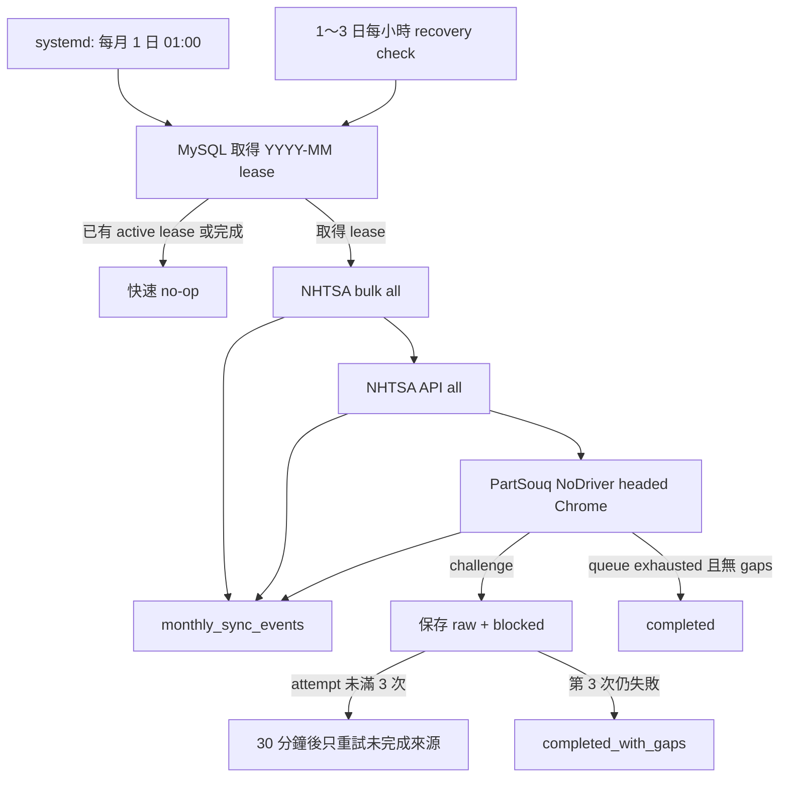

# NHTSA／PartSouq 每月無人值守爬蟲：實作、驗收與風險報告

- 驗收時間：2026-08-10 13:07（Asia/Taipei）
- 程式版本基準：`012b4bb` 加本報告列出的 working-tree 變更
- 資料庫：MySQL 8，`partsouq`／`nhtsa` 分離 schema
- 排程目標：每月 1 日 01:00 開始，執行 1～2 天時不需人工介入

## 1. 先講結論

每月排程、MySQL 排重、lease／heartbeat／fencing、斷點續跑、DB log、journald、SIGTERM 收尾與 systemd recovery 都已實作並通過自動化 E2E。

但 PartSouq 必須分成兩個結論：

1. **本機 macOS 可以自動抓到 PartSouq 現行頁面。** Headed Google Chrome + NoDriver 在沒有人工點擊的情況下，初始 Cloudflare 403 自動轉成最終 200。實際走過 root → Toyota locate → pick → vehicle → unit，全部 200；production worker 也已把 raw response、SHA、解析結果與 provenance 寫進 MySQL。
2. **Linux server 尚不能宣稱一定成功。** 同一套 worker 在 Linux Docker + Xvfb 的 Chromium／Google Chrome 都維持 403；Docker 開啟 Chrome sandbox 時甚至無法啟動。正式交付因此只支援 Linux host + Xvfb + sandbox，且必須在實際 server 做 live preflight。現在沒有外部 Linux server 的帳號或執行環境，所以無法完成這一項現場驗證。

因此，**目前沒有把 PartSouq current/live 全量標成完成**。已確認的 live run 是可續跑的小規模 E2E，狀態為 `paused`；歷史 archive 的 165,438 筆 fitment 仍全部是 `is_verified=0`，不能當成今天的完整現行適用關係。

NHTSA 現有 current publication 已重新查證：457 個 current artifacts、9,876,638 source rows、current rejected rows 0。

## 2. 需求完成度

| 需求 | 狀態 | 實際證據 |
|---|---:|---|
| 每月 1 日 01:00 啟動 | 完成 | systemd `OnCalendar=*-*-01 01:00:00 Asia/Taipei`；`systemd-analyze calendar` 已驗證 |
| 全程無人工介入 | 完成於程式；server access 有條件 | NoDriver 不點 CAPTCHA；challenge 未自動解除就 raw-first 保存並停止 |
| NHTSA bulk + API | 完成 | 月排程固定執行 `scope all`；現有 457 artifacts／9,876,638 rows／0 rejected |
| PartSouq browser crawler | 完成於本機 | NoDriver + headed Chrome 實際 200、解析、MySQL ingest、resume |
| 任意 Linux server 穩定取得 PartSouq | **未確認** | Docker/Xvfb 3 次 403；sandbox 模式 1 次啟動失敗；真正 Linux host 尚未提供 |
| 同月份排重 | 完成 | `monthly_sync_runs.period_key` unique；重複啟動不會重跑 |
| 斷電／hard kill 復原 | 完成 | lease expiry + hourly recovery checks；max attempt exhausted 會落 `completed_with_gaps` |
| 只續未完成來源 | 完成 | 已完成 NHTSA／PartSouq source 會 skip；MySQL subprocess E2E 已驗 |
| 每頁／每來源 log | 完成 | child JSON／文字 log 批次寫 `monthly_sync_events`，同時保留 journald |
| 後續查詢 | 完成 | `monthly-status --event-limit` 回 run、source status、summary、event counts、latest events |
| Challenge bounded retry | 完成 | 相同 profile、30 分鐘間隔、最多 3 次；robots 與 challenged queue 都可重取 |
| 完整自測與 E2E | 完成 | 126 passed、81% coverage；詳見第 9 節 |
| 外部 production Linux server 安裝 | **未執行** | 本工作區沒有可登入的目標 server；production `monthly_sync_runs` 目前為 0 |

## 3. 每月執行流程



設計重點：

- 排程依序跑 NHTSA bulk、NHTSA API、PartSouq，避免三條大量資料管線同時壓 MySQL、網路與磁碟。
- 月 run 的 owner 每 60 秒 heartbeat；server 範本 lease 是 900 秒。
- 所有更新都要求 `owner_id + fencing_token`；過期 process 回魂也不能覆寫新 owner。
- 子程序 stdout/stderr 會持續被讀取，50 筆一批寫 DB。DB log 寫入失敗時，orchestrator 會終止 child，不會讓 pipe 塞滿後假性卡死。
- SIGINT／SIGTERM 先給 child 30 秒收尾，才強制 kill；source 與 monthly run 都會留下 `interrupted`／`failed` 狀態。
- 初次排程以外，1 日 02:00～23:00、2～3 日每小時做 recovery check。active 或 terminal run 只會 no-op。

## 4. MySQL Schema

### `monthly_sync_runs`

| 欄位群組 | 欄位 | 用途 |
|---|---|---|
| Identity | `id`, `period_key`, `scheduled_for` | `period_key=YYYY-MM` 唯一，防止同月份重複執行 |
| Lease | `status`, `owner_id`, `fencing_token`, `lease_expires_at`, `heartbeat_at` | 單一 owner、租約續期、stale writer fencing |
| Attempts | `attempts`, `max_attempts` | 預設最多 3 次；耗盡後終止為 `completed_with_gaps` |
| NHTSA bulk | `nhtsa_bulk_status`, `nhtsa_bulk_run_key` | source checkpoint 與 lineage |
| NHTSA API | `nhtsa_api_status`, `nhtsa_api_run_key` | source checkpoint 與 lineage |
| PartSouq | `partsouq_status`, `partsouq_run_key` | 對應既有 `crawl_runs`／persistent queue |
| Audit | `config_json`, `summary_json`, `last_error` | 公開設定、最後結果與錯誤；不存 MySQL password |
| Time | `created_at`, `started_at`, `updated_at`, `ended_at` | 全部使用 MySQL server UTC `DATETIME(6)` |

### `monthly_sync_events`

| 欄位 | 用途 |
|---|---|
| `monthly_run_id`, `fencing_token` | 對應月 run 與當次 owner generation |
| `source_name` | `orchestrator`／`nhtsa_bulk`／`nhtsa_api`／`partsouq` |
| `level`, `event_type`, `message` | 可查詢的結構化 log |
| `details_json` | child 原始 JSON；純文字輸出包成 `{ "line": ... }` |
| `occurred_at` | MySQL server UTC 時間 |

索引：`(monthly_run_id,id)` 與 `(monthly_run_id,source_name,event_type,id)`。外鍵連到 `monthly_sync_runs`。

權威 migration：`src/partsouq_crawler/db/mysql_migrations/005_monthly_sync_runs.sql`。

原本的資料表仍各自保存細節：

- PartSouq：`crawl_runs`、`crawl_queue`、`http_responses`、`response_bodies`、normalized tables、`record_sources`。
- NHTSA：`nhtsa_sync_runs`、`nhtsa_source_artifacts`、`nhtsa_artifact_members`、`nhtsa_artifact_records`、`nhtsa_record_versions`、`nhtsa_current_artifacts`。

## 5. PartSouq Cloudflare 調查與實測

### 方案矩陣

| 方法 | 環境 | 結果 | 判定 |
|---|---|---:|---|
| aiohttp | macOS，同網路 | 403 challenge | 不可用於 live catalog |
| Playwright + headed Brave + persistent profile | macOS | 60 秒後仍 403 | 不採用 |
| Patchright + headed Brave | macOS | `navigator.webdriver=false`，仍 403 | 單一 JS flag 不是解法 |
| NoDriver 0.50.3 + headed Google Chrome fresh profile | macOS | 初始 403，自動轉最終 200 | **本機成功，無人工點擊** |
| NoDriver + true headless Chrome | macOS | 403 | 不採用 true headless |
| SeleniumBase UC 4.49.2 | macOS | WebDriver session 120 秒逾時 | 未取得網站 response，不採用 |
| Linux Chromium + Xvfb + `--no-sandbox` | Docker | 403，6,118 bytes | 不合格 |
| Linux Google Chrome + Xvfb + `--no-sandbox` fresh profile | Docker | 403，6,118 bytes | 不合格 |
| 同一 Google Chrome persistent profile 第二次 | Docker | 仍 403，6,118 bytes | profile 暖機不能解決 |
| Linux Google Chrome + sandbox | Docker | Chrome 無法啟動 | Docker production path 已移除 |

Cloudflare 官方文件明列 headless browser 與 automation framework 可能不受支援；因此不存在「換一個 Selenium 套件就保證通過」的結論：[Cloudflare supported browsers](https://developers.cloudflare.com/cloudflare-challenges/reference/supported-browsers/)。

NoDriver 官方說明支援 Chrome／Chromium／Brave、persistent profile，並建議無螢幕 Linux 使用 Xvfb：[NoDriver](https://github.com/ultrafunkamsterdam/nodriver)。本次採用它是因為有實際 200 證據，不是只根據套件宣傳。

SeleniumBase UC 官方同樣建議 Linux 使用 Xvfb 而非 true headless：[SeleniumBase UC mode](https://seleniumbase.io/help_docs/uc_mode/)。本機實測停在 WebDriver startup，因此沒有把它混進 NoDriver worker。

### 成功的 live 證據

Production root probe：

- run key：`partsouq-live-nodriver-probe-mainframe-20260810`
- response id：26,894
- HTTP：200
- bytes：141,707
- SHA-256：`7e33735c99629d46a68a7f05d912dd04109cebbd731e6d22508d1ee3b0acde7e`
- `x-partsouq-challenge-observed=true`
- `x-partsouq-final-challenge-active=false`
- `x-partsouq-body-kind=raw-http`
- normalized provenance：2 rows（1 vehicle configuration、1 taxonomy node）

這證明瀏覽器確實先看到 challenge，之後由網站／瀏覽器流程自動進到正常 200；不是把 challenge HTML 誤判成型錄。

實際導航另外走過 root → Toyota locate → pick → vehicle → unit，五段皆 200。unit parser 產生 1 vehicle、1 taxonomy、1 diagram、14 parts、469 links。

### 斷點續爬證據

Run `partsouq-live-nodriver-e2e-20260810`：

- 第一次：done 6、pending 150、responses 7。
- 用相同 run 與相同 profile、`max-pages=1` 重啟。
- 只取得既有 queue id 33：`/honda-catalogmap.xml`，HTTP 200，6,914,673 bytes。
- 第二次：done 7、pending 149、responses 8、challenge 0、failed 0。
- 8 個 response 合計 11,247,953 bytes。

前 6 頁沒有重抓，證明 resume 是 DB queue 的實際行為，不只是 mock。

### Server 限制

Docker Google Chrome 測試是在 ARM macOS host 上模擬 linux/amd64；它不是一台真正 x86 Linux host。不過 Chromium native 與 Chrome emulation 都失敗，所以也不能假設換到 server 就自然成功。

正式部署的最低門檻：

1. Linux host 直接安裝 Google Chrome stable、Xvfb、Python 3.12。
2. 使用非 root `partsouq-crawler` 帳號。
3. Chrome sandbox 必須開啟；排程腳本拒絕 `PARTSOUQ_BROWSER_SANDBOX=0`。
4. profile 放 `/var/lib/partsouq-crawler/browser-profile` 並跨月份保留。
5. 在同一台 host、同一個 egress IP 實跑 probe；必須 final 200 才能啟用 timer。

## 6. 現有資料實況

### PartSouq MySQL

| Entity | Rows | 說明 |
|---|---:|---|
| vehicle configurations | 21,510 | 包含本次 live root 新增 1 筆 |
| taxonomy nodes | 74,624 | 包含本次 live root 新增 1 筆 |
| diagrams | 2,724 | 主要為 historical archive |
| part numbers | 52,102 | 主要為 historical archive |
| part occurrences | 159,505 | historical provenance |
| fitments | 165,438 | `verified=0` 165,438；`verified=1` 0 |
| HTTP responses | 26,475 | live、challenge、archive 合計 |
| normalized records missing provenance | 0 | 實際 SQL 對帳 |

重要：165,438 是目前 MySQL 的歷史 fitment 筆數，不是 PartSouq 現行網站已全量抓完。

### NHTSA MySQL

| 指標 | 數值 |
|---|---:|
| current artifacts | 457 |
| published source rows | 9,876,638 |
| current rejected rows | 0 |
| datasets | 12 |

資料集：complaints、CSSI stations、investigations、manufacturer communications detail／summary、recalls、safety ratings、vPIC makes／models／manufacturers／variables／variable values。

## 7. Server 部署

### 目錄與 runtime

```bash
sudo useradd --system --create-home --home-dir /var/lib/partsouq-crawler partsouq-crawler
sudo mkdir -p /opt/partsouq-crawler/current /etc/partsouq-crawler
sudo chown -R partsouq-crawler:partsouq-crawler /opt/partsouq-crawler /var/lib/partsouq-crawler

cd /opt/partsouq-crawler/current
uv sync --extra dev --frozen
python3.12 -m venv .venv-browser
.venv-browser/bin/pip install --requirement browser_worker/requirements.txt
```

將 `deploy/systemd/monthly.env.example` 複製成 `/etc/partsouq-crawler/monthly.env`，填入兩個 schema 的低權限 MySQL 帳密、Chrome path、raw dir 與固定 User-Agent，權限必須 0600。

### 同機 preflight

```bash
sudo systemd-run --wait --pipe --collect \
  --unit=partsouq-preflight \
  --property=User=partsouq-crawler \
  --property=Group=partsouq-crawler \
  --property=WorkingDirectory=/opt/partsouq-crawler/current \
  --property=EnvironmentFile=/etc/partsouq-crawler/monthly.env \
  /usr/bin/xvfb-run --auto-servernum \
  --server-args='-screen 0 1920x1080x24 -nolisten tcp' \
  /opt/partsouq-crawler/current/.venv/bin/python -m partsouq_crawler probe \
  'https://partsouq.com/en/catalog/genuine' \
  --run-id server-preflight \
  --transport nodriver \
  --browser-executable /usr/bin/google-chrome-stable \
  --browser-profile-dir /var/lib/partsouq-crawler/browser-profile \
  --browser-worker-command \
  '/opt/partsouq-crawler/current/.venv-browser/bin/python /opt/partsouq-crawler/current/browser_worker/worker.py' \
  --browser-challenge-wait 90 --timeout 60
```

驗收：exit 0、HTTP 200、`cloudflare_challenge=false`、`parsed=true`。若是 exit 2／403，就不能宣稱該 server 可抓 current catalog；NHTSA 不受這個限制。

### 安裝 timer

```bash
sudo install -m 0644 deploy/systemd/partsouq-monthly-sync.service /etc/systemd/system/
sudo install -m 0644 deploy/systemd/partsouq-monthly-sync.timer /etc/systemd/system/
sudo systemctl daemon-reload
sudo systemctl enable --now partsouq-monthly-sync.timer
systemctl list-timers partsouq-monthly-sync.timer
```

## 8. 日常查看與 SQL

```bash
partsouq-crawler monthly-status --period 2026-08 --event-limit 200
journalctl -u partsouq-monthly-sync.service --since '2026-08-01 00:00:00'
partsouq-crawler crawl-status --run-id monthly-2026-08-partsouq
partsouq-crawler nhtsa-status
```

```sql
SELECT period_key, status, attempts, max_attempts,
       nhtsa_bulk_status, nhtsa_api_status, partsouq_status,
       started_at, heartbeat_at, ended_at, last_error
FROM monthly_sync_runs
ORDER BY period_key DESC;

SELECT source_name, level, event_type, message, details_json, occurred_at
FROM monthly_sync_events
WHERE monthly_run_id = ?
ORDER BY id;
```

Exit code：

- `0`：全部完成，或相同月份已完成／仍由其他 owner 執行而 no-op。
- `1`：可恢復失敗或中斷；systemd 30 分鐘後重試。
- `2`：3 次仍有缺口，或 terminal `completed_with_gaps`；保留資料與 log，不再無限重試。

## 9. 完整自測結果

最終指令：

```bash
NHTSA_TEST_MYSQL=1 PARTSOUQ_TEST_MYSQL=1 \
  .venv/bin/python -W error -m pytest \
  --cov=partsouq_crawler --cov-report=term:skip-covered
```

結果：**126 passed in 10.94s；statement coverage 81%**。

| 測試層 | 數量／結果 | 核心覆蓋 |
|---|---:|---|
| Unit | 102 passed | parser、challenge、CLI、browser worker protocol、monthly child/log/signal |
| Integration | 24 passed | fake HTTP、PartSouq MySQL、NHTSA MySQL、monthly MySQL subprocess E2E |
| Monthly lease E2E | pass | duplicate month no-op、active lease、stale fencing、event query |
| Monthly resume E2E | pass | 第一次 partial failure；第二次只續未完成 source |
| Hard-kill exhaustion | pass | inactive lease + max attempts 自動落 `completed_with_gaps` |
| Log storage failure | pass | DB event 寫失敗會終止 child，不會 pipe deadlock |
| SIGTERM | pass | active child 終止、run/source 記錄 interrupted |
| Challenge retry | pass | robots challenge refetch、challenged URL requeue、最多 3 次 |
| Real PartSouq macOS | pass | final 200、raw SHA、parse、provenance、同 run resume |
| Linux Docker negative E2E | expected fail | 3×403 challenge；1×sandbox startup failure；均正確入庫／回非 0 |

Static／package／deployment gates：

- `ruff check .`：pass。
- `ruff format --check .`：116 files formatted。
- `mypy src`：80 source files，0 issues。
- `git diff --check`：pass。
- `bash -n`、`compileall`：pass。
- `uv lock --check`、offline sdist／wheel build：pass。
- wheel 內含 `browser_worker_fetcher.py`、`models/schedule.py`、`monthly_sync.py`、migration 005。
- `systemd-analyze verify`：service + timer pass。
- calendar 三條語法實際 normalized；下一次首跑為 2026-09-01 01:00 Asia/Taipei。
- wrapper 正常 preflight exit 0；`PARTSOUQ_BROWSER_SANDBOX=0` 會 exit 1。

## 10. Code review 結果

本次 review 找到並修正的穩定性問題：

1. Legitimate PartSouq 頁面內嵌 Turnstile script 會被舊 marker 誤判 challenge；已改成頁面級 title／visible text／header 判定並加 regression test。
2. CDP 原先可能抓到 Facebook iframe response；已限制 main-frame target 並保存最終 document body。
3. Browser 初始 403 轉 200 時原先會過早回傳；已等待 final stable document。
4. Browser worker restart／large line protocol 已測；大於 64 KiB body 不會被 `readline` 截斷。
5. Crawler log 原先可能顯示 `ssd`／VIN；已共用 URL redaction。
6. 月排程若 DB event writer 先死，child 可能因 pipe backpressure 卡住；已讓 reader failure 立即終止 child。
7. 第 3 次 process hard kill 後，舊 row 可能停在 stale `running`；已在下一次 acquire 自動 finalize 為 `completed_with_gaps`。
8. Challenge 原先 terminal 後沒有真正可重取路徑；已增加 explicit robots refetch 與 challenged queue requeue，仍受 3 次上限控制。
9. systemd recovery 原先只靠每月 trigger；已補 1～3 日 hourly checks，避免 timer 已觸發後主機重開而等到下個月。
10. systemd `NoNewPrivileges=true` 會禁止 setuid 取得新權限，可能破壞 Chrome sandbox fallback；host service 改為 false，但仍以非 root user、`ProtectSystem=strict`、`ProtectHome=true`、`PrivateTmp=true` 隔離。官方定義見 [systemd.exec](https://github.com/systemd/systemd/blob/main/man/systemd.exec.xml)。

MySQL queue 使用 `FOR UPDATE SKIP LOCKED`；MySQL 官方文件明確指出它適合 queue-like table，但不適合一般一致性讀取：[MySQL locking reads](https://dev.mysql.com/doc/refman/8.4/en/innodb-locking-reads.html)。

## 11. 注意事項與未完成項目

1. **PartSouq current/live 全量仍未完成。** 小型 live run 是 7 done／149 pending，且完整 universe 尚不可測量。
2. **production 每月排程尚未真正執行。** `partsouq.monthly_sync_runs=0`、`monthly_sync_events=0`；目前證據來自 `partsouq_test` MySQL E2E 與 systemd 靜態／Linux 容器測試。
3. **真正 Linux host preflight 是 release gate。** 沒有 final 200 就只能完成 NHTSA 與 PartSouq historical／blocked audit，不能承諾 current data。
4. Cloudflare 規則、Chrome 版本與 IP reputation 都可能改變。每月 run 必須看 `partsouq_status`、challenge count 與 normalized provenance，不可只看 process 是否結束。
5. NoDriver 0.50.3 宣告 AGPL-3.0。現在以獨立 process 隔離 proprietary core，但授權義務仍須由專業法律／合規人員確認。
6. 不使用付費第三方 bypass API、CAPTCHA solver、proxy、cookie 匯出／注入。這避免費用與敏感 session 搬運，但也代表遇到無法自動解除的互動式驗證時只能留下 `blocked`。
7. 165,438 個 historical fitment 全部未驗證；任何 current view 或對外說法都必須和 live source 分開。
8. `monthly.env` 含 DB 密碼，必須 0600，不得 commit。DB 掛掉時無法寫 DB log，因此 journald 是故障時的最後證據。
9. 首次 server run 建議先限制 PartSouq `max-pages` 做容量觀察；正式月排程目前是 unlimited、concurrency 1、delay 5 秒。

## 12. GitHub 與帳號邊界

- remote：`git@github.com:a861252012/partsouq-crawler.git`。
- 禁止使用 Bibian 帳號、公司 SSH key 或公司 browser session。
- 本報告產生時變更仍在 working tree；尚未把本輪變更 push 到 remote。
- Push 前必須再次驗證 `gh auth status`、SSH welcome、remote owner 都是 `a861252012`，並排除 `.env`、raw data、browser profile、`downloaded_files/`。

## 13. 最終判定

- **NHTSA 每月無人值守：可部署。**
- **月排重／續跑／log／DB audit：可部署。**
- **PartSouq crawler 程式：本機已成功，功能不是「技術上完全做不到」。**
- **PartSouq 在指定 Linux server：必須先通過同機 preflight，現在沒有足夠資料宣稱成功。**
- **PartSouq current 全量：尚未完成，不能用 165,438 historical fitments 冒充。**
